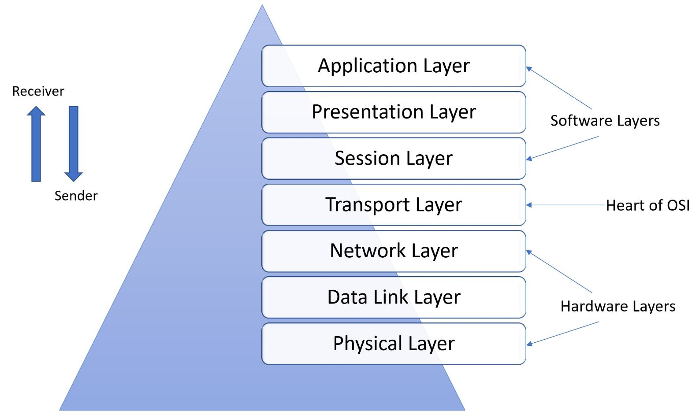

# Các tầng trong mô hình OSI (7 layers) — giải thích + quy trình gửi/nhận dữ liệu chi tiết

---

## Tổng quan nhanh (tên tầng & PDU)

1. **Layer 7 — Application**: dữ liệu ứng dụng (Data / Message)
2. **Layer 6 — Presentation**: format / mã hóa (Data)
3. **Layer 5 — Session**: quản lý phiên (Session data)
4. **Layer 4 — Transport**: **Segment** (TCP) / **Datagram** (UDP) — ports, checksum, flow control
5. **Layer 3 — Network**: **Packet** — IP header (src/dst IP), routing
6. **Layer 2 — Data Link**: **Frame** — MAC src/dst, EtherType, FCS (CRC)
7. **Layer 1 — Physical**: **Bits** — tín hiệu điện/optical/wireless

Một cách tắt: **Message → Segment → Packet → Frame → Bits**.

---

## Vai trò, header chính và ví dụ ngắn cho từng tầng

### Layer 7 — Application

* **Chức năng:** giao diện cho ứng dụng (HTTP, DNS, FTP, SSH, SMB...).
* **PDU tên:** Data / Message.
* **Ví dụ header:** trong HTTP có request line (`GET /index.html HTTP/1.1`) + headers (Host, User-Agent...).
* **Lab:** kiểm tra bằng `curl`, browser, Burp, `nikto`.

### Layer 6 — Presentation

* **Chức năng:** mã hóa/giải mã (TLS), nén, chuyển mã (UTF-8).
* **Ví dụ:** TLS/SSL thực hiện tại đây (mã hóa payload cho HTTPS).
* **Lab:** xem certificate, kiểm tra SSL configs (OpenSSL).

### Layer 5 — Session

* **Chức năng:** quản lý session/phiên (establish/tear-down), đồng bộ hóa.
* **Ví dụ:** giữ session authenticated, cookies, hoặc TLS session resumption.
* **Lab:** session fixation, session hijacking (web).

### Layer 4 — Transport (RẤT quan trọng)

* **Chức năng:** đảm bảo (TCP) hoặc không đảm bảo (UDP) truyền tải, phân mảnh theo port, flow control, retransmission.
* **PDU:** **Segment** (TCP) hoặc **Datagram** (UDP).
* **Header chính (TCP):**

  * Source Port, Destination Port (ví dụ `54321 → 80`)
  * Sequence Number, Acknowledgement Number
  * Flags: SYN, ACK, FIN, RST, PSH, URG
  * Window Size (flow control)
  * Checksum
* **Header chính (UDP):** src port, dst port, length, checksum (không kết nối, không ACK).
* **Lab:** `netstat`, `tcpdump`, `wireshark`, `nmap -sS` (SYN scan), `nmap -sU` (UDP).

### Layer 3 — Network

* **Chức năng:** định tuyến (router), chọn đường đi; IP addressing; fragmentation (nếu cần).
* **PDU:** **Packet** (IP packet).
* **Header chính (IPv4):**

  * Version, IHL, Total Length, TTL, Protocol, Header Checksum, Source IP, Destination IP
* **Ghi chú:** TTL giảm mỗi hop; nếu TTL=0, router trả ICMP TTL expired.
* **Lab:** `traceroute`/`tracert`, `ping` (ICMP).

### Layer 2 — Data Link

* **Chức năng:** truyền frame trong cùng broadcast domain, xử lý MAC addresses, ARP.
* **PDU:** **Frame**.
* **Header chính:** Destination MAC, Source MAC, EtherType, Payload, FCS (CRC).
* **Ghi chú:** Switch hoạt động ở đây (forward theo MAC). ARP ánh xạ IP→MAC.
* **Lab:** `arp -a`, `arp-scan`, `ettercap`, `mac spoofing`.

### Layer 1 — Physical

* **Chức năng:** bits vật lý — cáp (Ethernet), sóng (Wi-Fi), tín hiệu điện/optical.
* **Ghi chú:** MTU giới hạn frame size (Ethernet thường 1500 bytes). Fragmentation xảy ra nếu packet > MTU.

---

## Quy trình chi tiết khi gửi và nhận — **ví dụ thực tế**: Laptop (192.168.1.10, MAC A.A.A) gửi **HTTP GET** tới web server (93.184.216.34:80)

Tình huống: Laptop muốn truy vấn `http://example.com/`.

### 1) Application (Layer 7)

* Trình duyệt tạo HTTP request: `GET / HTTP/1.1`, header `Host: example.com`.

### 2) Presentation (Layer 6)

* Nếu là HTTPS, dữ liệu ở đây sẽ được **mã hóa** bằng TLS và presentation trả về payload đã mã hóa. Với HTTP plain — không mã hóa.

### 3) Session (Layer 5)

* Quản lý session (cookies, keep-alive). Nếu chưa có TCP connection: cần mở session → đi xuống transport.

### 4) Transport (Layer 4) — TCP 3-way handshake

* **SYN:** Laptop tạo segment TCP: src port = `54321`, dst port = `80`, flag = SYN, seq = X.
  → trình bày: `Segment: [SrcPort=54321, DstPort=80, Flags=SYN, Seq=X]`
* **SYN-ACK:** Server trả lại SYN+ACK: `Seq=Y`, `Ack=X+1`, Flags=SYN,ACK.
* **ACK:** Laptop gửi ACK: `Ack=Y+1`. Kết nối TCP established.
* **Dữ liệu:** Laptop gửi TCP segment chứa HTTP GET (một hoặc nhiều segments tùy size). Server ACK từng segment hoặc theo window.
* **Tear-down:** FIN/ACK sequence để đóng kết nối.

**Nếu UDP:** không có handshake; ta gửi datagram trực tiếp (`src port`, `dst port`), không có ACK/retransmit (ứng dụng phải xử lý nếu cần).

### 5) Network (Layer 3)

* Transport segment được đóng gói vào IP packet: IP header với `SrcIP=192.168.1.10`, `DstIP=93.184.216.34`, TTL, Protocol=TCP.
* Nếu `DstIP` không trong cùng subnet → máy gửi tới **Default Gateway** (router/hotspot). Để gửi tới gateway máy cần biết MAC của gateway → dùng **ARP** nếu cần:

  * ARP Request: “Who has 192.168.1.1? Tell 192.168.1.10”
  * ARP Reply: gateway trả MAC `BB:BB:BB`.
* Nếu packet size > MTU (1500), IP fragmentation có thể xảy ra (router hoặc host phân mảnh).

### 6) Data Link (Layer 2)

* Gói IP gói vào Ethernet frame: `DstMAC = MAC of gateway`, `SrcMAC = laptop MAC`.
* Frame truyền qua cáp/wifi lên switch/AP — switch forward theo MAC.

### 7) Physical (Layer 1)

* Frame chuyển thành tín hiệu điện / sóng, đi qua các thiết bị trung gian (router, ISP) — tại mỗi hop router, frame bị bóc, packet được kiểm tra IP, TTL giảm, router gói lại frame mới cho hop tiếp theo (MAC thay đổi).

### 8) Ở máy chủ đích

* Gói tới router của mạng server, router chuyển tới host; ở local network của server:

  * Frame tới NIC server: NIC kiểm tra FCS, trừ header ethernet, pass packet lên layer 3.
* **Decapsulation diễn ra ngược lại:**

  * Layer 3: IP packet để lại IP header → kiểm tra dst IP → pass payload (TCP segment) lên layer 4.
  * Layer 4: TCP kiểm tra port (80) → đưa payload (HTTP request) lên layer 7 cho web server xử lý.
* Web server trả HTTP response → mọi thứ ngược lại (server tạo TCP segments → IP packet → frames → routing về laptop).

---

## Một số chi tiết quan trọng cần biết (eJPT hữu dụng)

### TCP flags và Sequence/ACK

* SYN bắt đầu connection; SYN-ACK phản hồi; ACK xác nhận. FIN để đóng. RST để reset connection.
* Sequence numbers giúp **tái tạo dữ liệu** khi bị phân mảnh; ACK numbers xác nhận đã nhận.
* Window size điều chỉnh flow control — nếu receiver chậm sẽ giảm window.

### Fragmentation & MTU

* MTU Ethernet tiêu chuẩn 1500 bytes. Nếu IP packet > MTU, host/router phân mảnh (IPv4). Fragmentation header + offset để receiver ghép lại. Fragmentation gây overhead, security issues.

### ARP & Proxy ARP & Gratuitous ARP

* ARP mapping IP→MAC trong LAN. Gratuitous ARP: host phát ARP advertisement để cập nhật bảng ARP của neighbor (dùng trong failover).
* ARP spoofing/poisoning là vector tấn công (man-in-the-middle).

### NAT / CGNAT

* NAT thay đổi IP source khi ra Internet; port forwarding map public port → private host. Nếu CGNAT, có thể không có IP public trực tiếp → không thể inbound.

### ICMP

* ICMP dùng để báo lỗi (Destination unreachable, TTL expired) và echo (ping). Dùng để debug mạng; có thể bị block.

---

